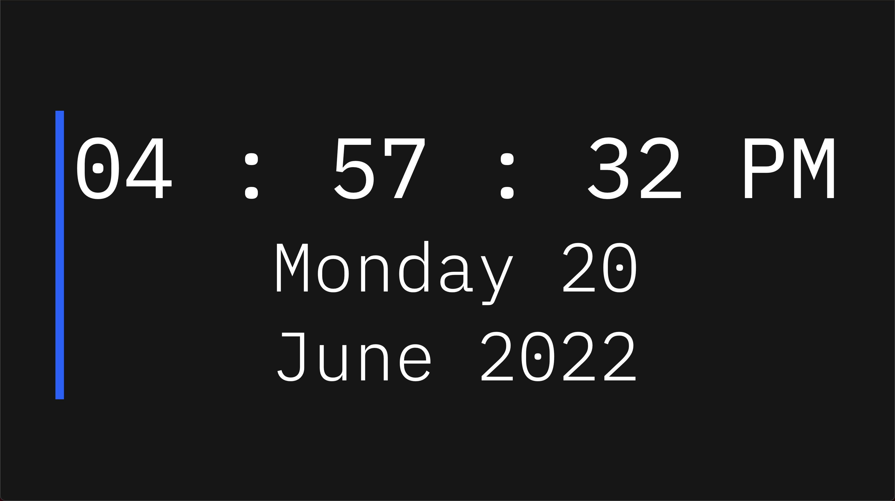

# Clock

This is a project I made when learning javascript basics. It is a simple clock that displays the time and date in my preferred format.

[Take a look at the time](https://cesar-martinez-clock.netlify.app/)

